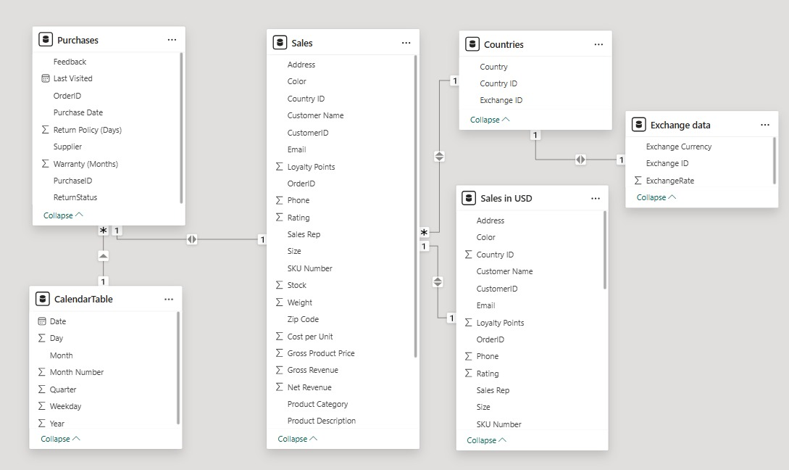
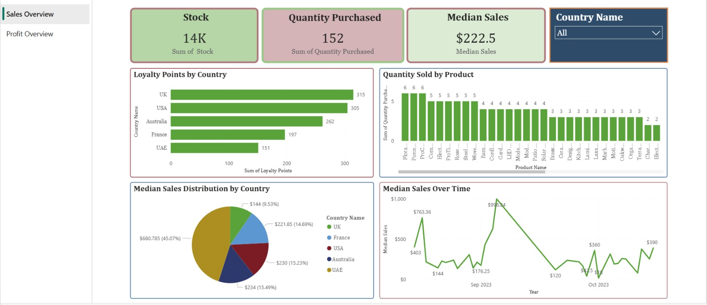
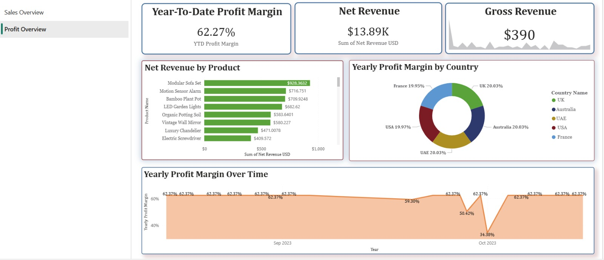
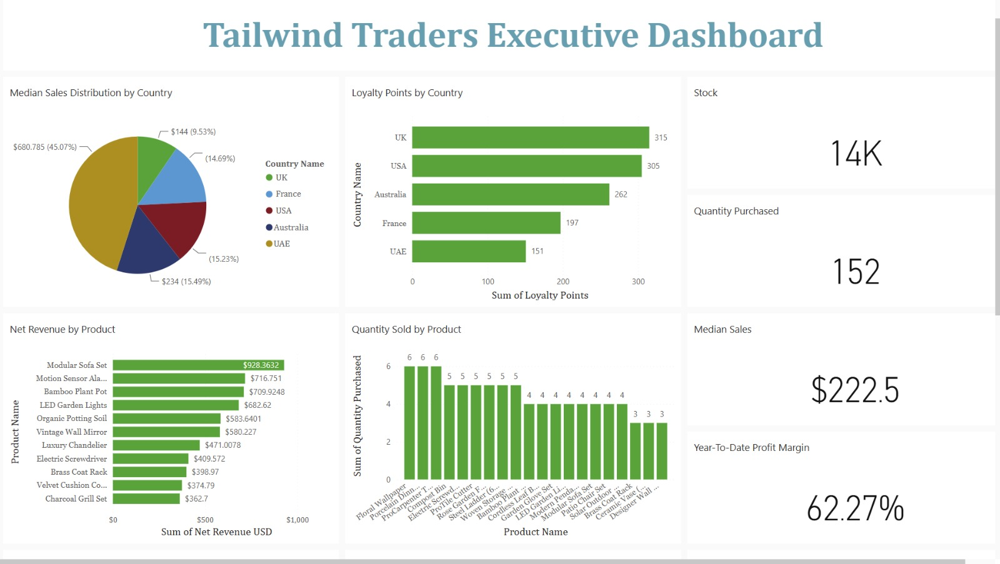

# Tailwind Traders – Power BI Business Analytics Project

## Business Context

Tailwind Traders is a retail business operating across multiple countries and product categories.
The leadership team requires clear visibility into sales performance, profitability, and customer
engagement in order to make informed business decisions.

This project focuses on building an end-to-end analytics solution using Power BI to transform
raw sales data into reliable, decision-ready insights through proper data preparation,
data modeling, analysis, and reporting.

## Table of Contents

- [Business Context](#business-context)
- [Project Objectives](#project-objectives)
- [Project Structure](#project-structure)
- [Data Preparation & Modeling](#data-preparation--modeling)
- [Analysis & Reporting](#analysis--reporting)
- [Executive Dashboard, Alerts & Subscriptions](#executive-dashboard-alerts--subscriptions)
- [Key Business Insights](#key-business-insights)
- [Tools & Technologies](#tools--technologies)
- [Final Summary](#final-summary)

## Project Objectives

The objective of this project was to design a business-ready analytics solution that enables
stakeholders to monitor sales performance and profitability across products, countries,
and time periods.

Specifically, the project aimed to:
- Prepare and validate raw sales data for analysis
- Build a structured and scalable data model in Power BI
- Define meaningful business metrics such as revenue and profit margin
- Create interactive reports to analyze trends and performance
- Deliver insights in a format suitable for executive decision-making

## Project Structure

The repository is organized to reflect how analytics projects are structured in
professional environments, with a clear separation between data, reports,
documentation, and outputs.

data/
- raw/        → Original, unmodified datasets as received
- processed/  → Enriched Sales dataset prepared for analysis

powerbi/
- reports/    → Power BI report (.pbix) containing data model, DAX, and visuals
- dashboard/  → Executive dashboard notes and references from Power BI Service

documentation/
- Explanations of assumptions, data modeling decisions, and metric definitions

screenshots/
- Visual previews of reports, dashboards, and data model

## Data Preparation & Modeling

Before building reports or dashboards, the focus was on ensuring that the data
was accurate, consistent, and structured correctly for analysis.

Sales data was initially prepared in Excel to validate business logic and
calculate essential financial fields such as revenue, tax, and profit.
This early preparation helped confirm that the numbers made sense before
moving into Power BI.

Multiple datasets, including sales, purchases, countries, and historical exchange
rates, were then integrated in Power BI. Historical exchange data was imported
using a Python script within Power Query, allowing currency conversion logic to
be handled during data ingestion rather than at the reporting layer. Data types 
were validated, relationships were defined, and a calendar table was introduced 
to ensure accurate time-based analysis

To enable consistent financial comparison across regions, all monetary values
were standardized into a single currency. The resulting data model was designed
to support scalable analysis across products, countries, and time periods.

### 📐 Data Model (Power BI)

## Analysis & Reporting

With a clean and well-structured data model in place, the focus shifted to
analyzing sales performance and profitability from a business perspective.

Key analytical measures were defined to evaluate performance across different
time periods, including yearly, quarterly, and year-to-date views. Median sales
were also used alongside totals to better represent typical sales behavior and
reduce the influence of extreme values.

Two primary report pages were designed to support analysis:
- **Sales Overview**, focusing on product demand, customer engagement, and sales trends
- **Profit Overview**, focusing on revenue generation and profitability across products and regions

Visualizations were selected based on the type of insight required. Bar and
column charts were used for comparison across categories, line and area charts
were used to analyze trends over time, and KPI visuals highlighted key business
metrics for quick evaluation.

### Sales Overview

### Profit Overview

## Executive Dashboard, Alerts & Subscriptions

To support executive-level decision-making, an interactive dashboard was created
in Power BI Service. The dashboard consolidates key sales and profitability
metrics into a single, high-level view designed for quick performance monitoring.

Key visuals and KPIs from the Sales and Profit reports were pinned to the
dashboard, allowing stakeholders to track trends without navigating full
report pages. A mobile-optimized layout was also configured to ensure insights
could be accessed easily on smaller devices.

### 📊 Executive Dashboard Preview

To enable proactive monitoring, data-driven alerts were configured on critical
revenue indicators. Scheduled report subscriptions were also set up to deliver
sales and profit summaries automatically on a recurring basis.

These features ensure that insights are delivered consistently and proactively,
reducing the need for manual report checks and supporting timely business
decisions.

## Key Business Insights

The analysis delivered several actionable insights that help explain overall
business performance and customer behavior:

- The business generated approximately **$13.89K in net revenue**, achieving a
  **62.27% year-to-date profit margin**, indicating strong operational efficiency.

- The **Modular Sofa Set** emerged as the highest net revenue–generating product,
  contributing approximately **$928.36 USD**, making it a key driver of sales
  performance.

- Customer engagement analysis showed that the **UK recorded the highest loyalty
  points**, while **UAE customers exhibited the highest median sales value**,
  highlighting differences in engagement versus transaction size across regions.

- Profit margin trends were relatively consistent across countries, suggesting
  stable pricing and cost structures across markets.

## Tools & Technologies

The following tools and technologies were used across different stages of the
analytics workflow:

- **Microsoft Excel** – Initial data preparation and validation
- **Power BI Desktop** – Data modeling, DAX calculations, and report development
- **Power BI Service** – Dashboard creation, alerts, and scheduled subscriptions
- **DAX** – Business metrics and time-based calculations
- **Python (Power Query integration)** – Importing historical exchange rate data

## Final Summary

This project demonstrates an end-to-end business analytics workflow, starting
from raw data preparation and progressing through data modeling, analysis,
reporting, and executive-level insight delivery.

Rather than focusing solely on visual design, the emphasis was placed on data
quality, meaningful metrics, and actionable insights. The resulting solution
supports both exploratory analysis and proactive decision-making through
dashboards, alerts, and automated reporting.

Overall, this project reflects how a data analyst approaches real-world business
problems by transforming data into clarity and insight.

> **Note:** This project is based on a retail business scenario and was developed as part of a
professional analytics capstone for learning and portfolio purposes.

